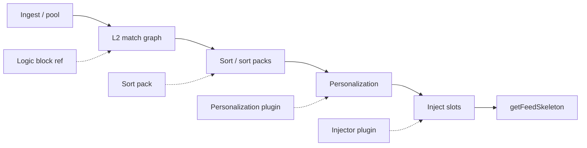

# CFB Marketplace & Extension Ecosystem — Reference

> **Status:** Living reference v0.5  
> **Last updated:** 2026-06-17  
> **Audience:** product + implementation — the canonical map for marketplace, logic blocks, plugins, and standard formats.

Related docs:

| Doc | Role |
|-----|------|
| [PLAN.md](./PLAN.md) | Whole-product vision, L1/L2 pipeline, phased plugin runtime |
| [STATUS.md](./STATUS.md) | What works today in the app |
| [MODULARITY.md](./MODULARITY.md) | Package boundaries |
| [BUILD_L2.md](./BUILD_L2.md) | L2 visual editor & eval |

---

## 1. What this ecosystem is

Custom Feed Builder is not only a feed builder — it is a **platform** where operators extend matching, ranking, and serving beyond built-in nodes. Extensions attach at specific points on the feed pipeline. They share a common **marketplace** for discovery, subscription, versioning, and trust — but they are **not one generic “plugin” blob**.

**Design principle:** ship the safe, native path first (JSON logic blocks), then add custom code tiers with stronger sandboxing and verification.

---

## 2. The feed pipeline

Everything hangs off this line:

```
Jetstream / ingest
       ↓
   L1 prefilter  →  project pool (Postgres)
       ↓
   L2 match      ← Logic blocks attach here (+ editor_score accumulation)
       ↓
   sort          ← Sort packs attach here (pool sort → sort_key in DB)
       ↓
   personalize   ← Personalization plugins attach here (per-viewer, serve-time)
       ↓
   inject        ← Injectors attach here (ads, promos)
       ↓
   getFeedSkeleton
```



**Mental model for operators:**

```
┌─────────────────────────────────────────┐
│ 1. WHO GETS IN     → L2 logic blocks    │
│ 2. DEFAULT ORDER   → Sort / sort packs  │  ← "editorial algorithm"
│ 3. PERSONAL TOUCH  → Personalization     │  ← "for you" layer (optional)
│ 4. PROMOS          → Injector (optional) │
└─────────────────────────────────────────┘
```

**Key insight from product design:** ads and injected posts do **not** belong in the L2 filter graph (they should not pass through match rules). They run **after** sort, before skeleton response.
---

## 3. Extension kinds (taxonomy)

Four kinds, increasing risk and runtime complexity:

| Kind | What it is | Pipeline stage | Runtime | Trust |
|------|------------|----------------|---------|-------|
| **Logic block** | Reusable native L2 subgraph (container node) | L2 match | Native JSON (`L2RuleGroup`) | Low — schema + compile check |
| **Sort pack** | Published `L2Expr` sort formula | Sort / `sort_key` at **candidate build** | Native JSON | Low — any user can save |
| **Personalization** | Per-viewer reorder at **serve time** | `onSort` hook | Native config, remote URL, worker/WASM (later) | Medium–high — **verified publishers only** |
| **Injector** | Insert URIs after sort (ads, promos) | `onInject` hook | Native config, remote URL, worker/WASM (later) | Medium–high — **verified publishers only** |

### 3.0 Native vs Custom Code (1:1 for every type)

Every extension kind has a **native** variant (declarative JSON the platform can inspect, diff, and run fast) and a **custom code** variant (verified publisher, sandboxed, same slot, different runtime).

| Type | Native | Custom Code |
|------|--------|-------------|
| **Logic** | Visual graph nodes (`L2RuleGroup`) | Verified custom node dropped into the visual graph (black-box filter) |
| **Sort** | Sort packs (`L2Expr` formula) | Code that receives all numeric fields + `editor_score` → returns `sort_key` |
| **Personalization** | Built-in behaviors (boost follows, demote seen) | WASM/remote plugin at serve-time, receives page + viewer context |
| **Injector** | Static URI slot config | WASM/remote plugin, receives page → inserts URIs |

**Unified rule:**
- **Native** = declarative JSON the platform can inspect, diff, and run fast.
- **Custom code** = verified publisher, sandboxed, same slot (filter / sort / personalize / inject), different runtime.

### 3.1 Sort packs vs personalization (not the same thing)

These feel similar because both affect "what order posts appear in," but they run at **different stages**:

| | Sort pack | Personalization plugin |
|---|-----------|------------------------|
| **When** | Ingest / candidate rebuild (`sort_key` in Postgres) | `getFeedSkeleton` (each page request) |
| **Input** | Post metrics + `editor_score` + `L2Expr` | Ordered URI list for the page + viewer context |
| **Who can publish** | Anyone (save to collection) | **Verified publishers** for custom code |
| **Runtime** | Native JSON or custom code | Native / remote today; uploaded code later |
| **Personalized?** | No — same for all viewers | Yes — can use viewerDid, follows, seen-state |

**UX model (feed tabs):**

1. **Sorting tab** — built-in modes + sort packs (how candidates are scored in the DB)
2. **Personalization tab** — optional per-viewer plugin reorder on each skeleton page
3. **Injector** — optional slots after personalization

**Rule of thumb:**
- If two users with different follow graphs should see different order from the same candidates → **personalization**.
- If the feed has a single editorial voice ("this is a breaking-news feed") → **sort pack**.

Most editorial logic belongs in **sorting**. Personalization is reserved for things sorting cannot do: viewer-specific signals, already-seen state, diversity rules, external live APIs.

### 3.2 Score node — editor_score in the visual graph

The L2 visual editor supports **Score nodes** that assign posts a numeric editorial score separate from Bluesky engagement metrics. This score can be used by sort packs as one of many sortable fields.

#### Semantics

- Each post carries a single mutable counter (`editor_score`), starts at **0**
- As the post flows through the graph, whenever it **passes** a Score node, that node’s value is **added** to the counter
- Score accumulates on the **post itself**, not per-path — forks don’t clone the counter
- At **END**: all matched posts receive a final **+1** (cold-start floor so no post has 0)
- `editor_score` is always computed for matched posts regardless of sort mode

#### Running total — score always sticks

If a post gains score on one pathway but then **fails** a later filter on that path, the score already gained is **retained**. If the post reaches END via a different pathway, it keeps all accumulated score from every Score node it passed through — even on dead-end paths.

Rationale:
1. Simpler — one counter, only goes up, never rolled back
2. Matches the "flowing water" mental model — the post *did* pass through that node
3. Rewards posts partially relevant to multiple criteria
4. Avoids complex retroactive path-tracking on diamonds/rejoins
5. Predictable UX — trace shows "+5 from hashtag boost" and that score is always visible

**If you want conditional scoring** (bonus only if the full path succeeds), use the **Conditional Score node** (see below).

#### Example

```
START → [Keyword A: passes] → Score +3 → FORK
                                          ├── path A (no score) → END
                                          └── path B → Score +1 → END
```

- Post qualifies via **both** paths: `editor_score` = 3 + 1 + 1(END) = **5**
- Post qualifies via **only path A**: `editor_score` = 3 + 0 + 1(END) = **4**
- Post qualifies via **only path B**: `editor_score` = 3 + 1 + 1(END) = **5**

#### Dead-end path example

```
START → [Keyword A: passes] → Score +3 → [Keyword B: FAILS] → END
      → [Hashtag node: passes] → Score +2 → END
```

- Post fails path 1 after gaining +3, but succeeds path 2 gaining +2
- Final `editor_score` = 3 + 2 + 1(END) = **6** (the +3 sticks)

#### Conditional Score node (future)

A second score node type: **Conditional Score**. Points from this node only count if the path it’s on fully reaches END. Use alongside regular Score nodes for "bonus only if you also pass everything after this" semantics.

- Regular Score node: always sticks (default, simple)
- Conditional Score node: rolled back if path fails before END

#### How editor_score integrates with sorting

- `editor_score` is exposed as an `L2NumericField` in sort packs (alongside `like_count`, `repost_count`, etc.)
- Custom code sort packs receive `editor_score` in their input data
- Chronological sort ignores `editor_score` (sorts by `indexedAt` only)
- Engagement formulas can combine: e.g. `editor_score * 1_000_000 + (likes + reposts)`
- Scale note: editor scores are typically 0–20; engagement can be 10⁵ — sort pack formulas should weight accordingly

#### Storage

- Computed at L2 eval time; stored on `feed_candidates` (column or score breakdown)
- Visible in match trace UI: shows which Score nodes contributed

---

### 3.3 Custom code publishing (verified publishers)

| Action | Requirement |
|--------|-------------|
| Create personalization / injector package | `deployment_verified` **or** `global_verified` publisher |
| Create custom code sort pack | `deployment_verified` **or** `global_verified` publisher |
| Create custom code logic node | `deployment_verified` **or** `global_verified` publisher |
| Publish to **deployment** catalog | `deployment_verified` |
| Publish to **global** catalog | `global_verified` (fema.monster) |
| Native logic blocks / native sort packs | No publisher verification required |

**UI:** My collection → sidebar **New custom code** → pick type (logic node, sort pack, personalization, or injector), native or remote endpoint.

**Native logic blocks** = visual editor JSON, no arbitrary code.
**Native sort packs** = declarative `L2Expr` formulas.
**Custom code logic nodes** = verified black-box filter node in the visual graph.
**Custom code sort packs** = verified code that receives numeric fields + `editor_score` → returns `sort_key`.
**Personalization / Injectors** = custom-code marketplace slots; today native config + remote HTTPS; uploaded bundles later.
### 3.4 What “Worker / WASM runtime” means

Today, custom rankers and injectors are **not** arbitrary uploaded code. They are:

- **Native** — CFB runs built-in adapters (pinned URIs, static inject URIs) driven by feed config
- **Remote** — you host an HTTPS endpoint; CFB POSTs context and applies your response under strict caps

**Worker** and **WASM** are the **next safety tier** for running *other people's* code:

| Runtime | Idea | Why |
|---------|------|-----|
| **Node worker** | Curated plugin runs in a sandboxed child process (timeout, memory cap, no raw DB) | Trusted publishers you approve |
| **WASM sandbox** | Plugin compiled to WebAssembly, no filesystem/network unless permitted | Community marketplace — untrusted code |

Without sandboxing, a plugin could exfiltrate data, burn CPU, or ignore slot caps. Worker/WASM is deferred until the marketplace + verification story is solid.

**Code:** `docs/PLAN.md` §9.2 phased runtime table.

---

## 4. Standard formats

### 4.1 CFB feed graph (`cfb-feed-graph`)

Native export/import for full feed logic + canvas layout. Implemented in `@cfb/l2-graph`.

```json
{
  "version": 1,
  "format": "cfb-feed-graph",
  "exportedAt": "2026-06-19T12:00:00.000Z",
  "match": {
    "type": "group",
    "id": "root",
    "logic": "all",
    "children": []
  },
  "visualLayout": {
    "positions": { "group-abc": { "x": 120, "y": 40 } },
    "edges": [{ "id": "e-start-group-abc", "source": "start", "target": "group-abc" }]
  },
  "rank": { "sortKey": { "type": "field", "field": "like_count" } }
}
```

- **`match`** — evaluated rule tree (`L2RuleGroup`)
- **`visualLayout`** — React Flow positions + edges (optional)
- **`rank`** — native sort expression (optional)

Also accepts converted **feed-gen** graph JSON on import.

**Code:** `packages/l2-graph/src/feed-graph-io.ts`

---

### 4.2 Logic block package (native)

A logic block is a versioned package whose payload is a single `L2RuleGroup` subtree.

**Types:** `packages/core-types/src/logic-blocks.ts`

```ts
interface LogicBlockPackage {
  id: string              // UUID
  ownerDid: string
  slug: string            // URL-safe name, unique per owner
  version: string         // semver patch bumps on logic save (1.0.0 → 1.0.1)
  name: string
  description?: string
  visibility: 'collection' | 'deployment' | 'global'
  trustTier: 'none' | 'deployment_verified' | 'global_verified'
  root: L2RuleGroup       // the packaged subgraph
  createdAt: string
  updatedAt: string
}
```

**In-feed reference node** (`logic_block_ref`):

```ts
{
  type: 'logic_block_ref',
  id: 'node-abc',
  packageId: '<uuid>',
  versionPin: '1.2.0',
  label: 'Urbanism boost pack',
  updatePolicy: 'pinned' | 'notify' | 'auto_minor'
}
```

**Eval behavior:** dereference at eval time — the ref node is replaced by the package `root` subtree when `resolveLogicBlock` is wired (`@cfb/l2-eval`, `@cfb/l2-worker`). The feed JSON stores the ref + pin; it does not inline the full subtree on every save.

**Code:** `packages/core-types/src/l2.ts` (`L2LogicBlockRefCondition`), `packages/l2-eval/src/logic-blocks.ts`

---

### 4.2b Sort pack package (native) — implemented

Same marketplace machinery as logic blocks, but payload is a native **`L2Expr`** sort formula.

**Types:** `packages/core-types/src/sort-packs.ts`

```ts
interface SortPackPackage {
  id: string
  ownerDid: string
  slug: string
  version: string
  name: string
  description?: string
  visibility: 'collection' | 'deployment' | 'global'
  trustTier: 'none' | 'deployment_verified' | 'global_verified'
  sortKey: L2Expr
  createdAt: string
  updatedAt: string
}
```

**In-feed reference** (`FeedConfig.rank.packRef`):

```ts
rank: {
  packRef: {
    packageId: '<uuid>',
    versionPin: '1.0.0',
    label: 'Discussion-heavy',
    updatePolicy: 'pinned' | 'notify' | 'auto_minor'
  }
}
```

**Eval behavior:** at candidate build, `packRef` resolves to `sortKey` from the subscribed package (with `auto_minor` patch resolution). Inline `rank.sortKey` is used when no `packRef`.

**Apply in UI:** Feed → **Sorting** tab → subscribed packs list, or **Save sort to collection**.

**Code:** `packages/storage-postgres/src/sort-packs.ts`, `apps/api/src/sort-packs.ts`, `packages/l2-worker/src/sort-pack-eval.ts`

---

### 4.3 Plugin manifest (injectors shipped; rankers planned)

Plugins (injectors, rankers) share a base manifest in `@cfb/core-types`:

```ts
interface PluginManifest {
  id: string
  version: string
  kind: 'injector' | 'ranker'
  runtime: 'native' | 'remote' | 'worker' | 'wasm'
  hooks: string[]          // injectors: ['onInject']
  permissions: string[]
  configSchema?: Record<string, unknown>
  disclosure?: string
}
```

**Shipped for injectors:** `plugin_packages` + `plugin_subscriptions`, marketplace browse/subscribe, `FeedConfig.injector`, `@cfb/feed-inject` runtime (native URI rotation + remote POST adapter), demo **Static URI injector** on operator hosts.

**Shipped for rankers (foundation):** `FeedRankConfig.rankerRef`, `@cfb/feed-rank` skeleton-time `onSort` (native pinned URIs + remote POST), demo **Pinned URI ranker**, marketplace Rankers tab + feed Sorting UI.

**Not yet:** viewer-aware per-request scoring, ingest-time ranker hooks.

**Shipped:** WASM + worker runtimes via `@cfb/plugin-wasm` (Extism host). See [WASM_PLUGINS.md](./WASM_PLUGINS.md).

---

## 4.4 How custom code will connect (design)

When a user finds a **ranker** or **injector** (or other custom-code kind) in the marketplace, the flow mirrors native packages but adds an **install artifact** step:

```
Browse marketplace → Subscribe → Download/install artifact → Configure per feed → Runtime invokes hook
```

| Step | Native (logic block / sort pack) | Custom code (ranker / injector) |
|------|----------------------------------|----------------------------------|
| Subscribe | Row in `*_subscriptions` + version pin | Same + `plugins_installed` row |
| Global registry | Mirror package JSON into local DB | **Download** WASM/worker bundle or fetch signed artifact URL |
| Feed wiring | `logic_block_ref` or `rank.packRef` in feed JSON | Dedicated slot: `feed.rank.rankerRef` or `feed.injector` config |
| Runtime | Dereference JSON at eval | Load module sandbox → call `onSort` / `onInject` |

**Yes — format must be standard.** Every custom-code listing ships a **CFB plugin manifest** (§4.3) plus a **kind-specific payload**:

| `runtime` | Artifact | Where it runs |
|-----------|----------|---------------|
| `native` | JSON only (logic block, sort pack) | In-process eval — today |
| `worker` | Node worker bundle (curated publishers) | Isolated thread, timeout, no DB |
| `wasm` | `.wasm` + manifest (community) | Sandbox |
| `remote-injector` | HTTPS endpoint + contract (ads, promos) | Feedgen calls URL at skeleton time — see §4.5 |

**Global marketplace download:** consumer deployments with `CFB_GLOBAL_MARKETPLACE_URL` already mirror native packages on subscribe. Custom code will add:

1. `GET /api/global-marketplace/plugins/:id/artifact` — signed download
2. Local `plugins_installed` stores `{ manifest, artifactPath, versionPin }`
3. Master can disable `runtime: wasm` or unverified publishers per deployment

**Never** embed arbitrary code inside the L2 visual graph. Custom rankers/injectors get **dedicated config UI** driven by `configSchema` in the manifest.

---

## 4.5 Injectors & ad networks

Injectors run **after sort, before `getFeedSkeleton`** — not in the filter graph.

```
sorted candidate URIs → injector hook → final page (organic + injected slots)
```

### Who controls frequency?

**The feed publisher** (via CFB UI), not the ad network alone. Feed config:

```ts
injector?: {
  packageId: string
  versionPin: string
  slots: { every: number; maxPerPage: number }  // e.g. 1 ad per 8 posts, max 2 per page
  disclosure?: string                            // describeFeedGenerator
  config?: Record<string, unknown>             // from manifest configSchema
}
```

The **injector plugin** (or remote adapter) receives slot rules + feed context. CFB merges returned URIs into the skeleton and **enforces caps locally**.

### Runtimes (shipped)

| Runtime | Behavior |
|---------|----------|
| `native` | Reads `config.uris` (`at://` strings), rotates into slots |
| `remote` | POST to `remoteEndpoint` with `{ feedId, limit, slots, config }` → `{ uris: string[] }` |

Demo on operator instances (`CFB_GLOBAL_MARKETPLACE_OPERATOR=true`): **Static URI injector** — subscribe in Marketplace → apply on feed **Sorting** tab → paste URIs.

### Remote URL injectors (ads)

Ad networks often expose a **URL** that returns post URIs. CFB does not blindly trust that URL to respect slot rules — the **injector adapter** enforces:

1. Publisher-configured `every` / `maxPerPage` caps
2. URI allowlist / ATProto validation (future hardening)
3. Verified publisher on the plugin listing
4. Opt-in per feed + disclosure string

```
Publisher UI: pick verified ad injector → set frequency → save feed
                    ↓
getFeedSkeleton: core sorted list → applyFeedInjector (@cfb/feed-inject)
                    ↓
              remote adapter may call ad network URL internally
                    ↓
              CFB merges + caps slots → response
```

**Code:** `packages/feed-inject/`, `packages/feedgen/src/inject.ts`, `packages/storage-postgres/src/plugins.ts`, `apps/api/src/plugins.ts`, `apps/web/src/components/plugins/`

---

## 5. Visibility & trust (three tiers + two seals)

### Visibility (where a listing appears)

| Tier | Who sees it | Purpose |
|------|-------------|---------|
| `collection` | Owner only | Private workspace — **My Collection** |
| `deployment` | All users on this VPS | This deployment’s catalog |
| `global` | Global marketplace tab (+ registry API) | Cross-deployment sharing |

Flow: author in **My Collection** → publish to **deployment** or **global**.

### Trust seals (publisher-level, not per-listing)

Verification is **per publisher handle/DID**, not per package:

| Seal | Who grants it | Applies to |
|------|---------------|------------|
| `deployment_verified` | Deployment master | `visibility: deployment` listings |
| `global_verified` | Platform operator (`fema.monster`) | `visibility: global` listings |

**Operator account:** `GLOBAL_MARKETPLACE_OPERATOR_HANDLE = 'fema.monster'` (not configurable per deployment).

**DB:** `logic_block_publisher_trust` — `(publisher_did, scope)` where scope is `deployment` | `global`.

When a verified publisher publishes a new listing, trust tier is applied automatically from publisher trust.

---

## 6. Subscriptions & update policies

Subscribing adds a package to the user’s library and enables inserting it in the visual editor (**Subscribed** palette).

| Policy | Behavior |
|--------|----------|
| `pinned` | Feed uses `versionPin` until operator upgrades manually |
| `notify` | Same as pinned + feed-level upgrade hints when catalog has newer version |
| `auto_minor` | At eval time, resolve latest patch with same major.minor (1.2.x) |

**Per-feed upgrade:** `FeedLogicBlockUpgradesPanel` scans `logic_block_ref` nodes, compares pins to catalog latest, offers apply per feed.

**Rules:**

- Auto-update only for **native** logic blocks (never silent major bumps).
- Custom code plugins (future): **never** auto-update without explicit per-feed opt-in.

**Code:** `packages/l2-eval/src/logic-block-upgrades.ts`, `apps/api/src/logic-block-upgrades.ts`

---

## 7. Global marketplace registry

Individual deployments browse global listings read-only. One **operator host** holds the canonical registry.

### Registry roles (`globalMarketplaceRegistryRole`)

| Role | Config | Behavior |
|------|--------|----------|
| `operator` | `CFB_GLOBAL_MARKETPLACE_OPERATOR=true` | Global listings in this DB; serves public catalog API |
| `consumer` | `CFB_GLOBAL_MARKETPLACE_URL=<url>` | Fetches catalog from remote registry; mirrors packages on subscribe |
| `embedded` | Neither set | Dev stub — global rows in same DB until operator or remote URL is configured |

### Public registry API (operator host, no auth)

| Endpoint | Purpose |
|----------|---------|
| `GET /api/global-marketplace/catalog` | Listing summaries (no `root` in list) |
| `GET /api/global-marketplace/catalog/:id` | Full package (`?version=` optional) |
| `GET /api/global-marketplace/catalog/:id/versions` | Version history |

### Env vars

```env
# Registry host (your main dev / fema.monster operator instance)
CFB_GLOBAL_MARKETPLACE_OPERATOR=true
CFB_GLOBAL_MARKETPLACE_OPERATOR_DID=did:plc:...   # optional pin

# Consumer deployments (other VPS instances)
CFB_GLOBAL_MARKETPLACE_URL=https://marketplace.fema.monster
```

**Code:** `apps/api/src/global-marketplace.ts`, `apps/api/src/global-marketplace-registry.ts`

**Future:** signed operator credentials for global verification on external registry; verification request queue; hosted registry at e.g. `marketplace.fema.monster`.

---

## 8. API reference (implemented)

Authenticated unless noted.

### Plugins (injectors / rankers)

| Method | Path | Purpose |
|--------|------|---------|
| GET | `/api/plugins/collection?kind=` | My custom code (verified publishers) |
| POST | `/api/plugins` | Create package (**publisher verification required**) |
| GET | `/api/plugins/subscriptions?kind=` | Installed subscriptions |
| GET | `/api/plugins/:id` | Package detail |
| GET | `/api/plugins/:id/versions` | Version list |
| POST | `/api/plugins/:id/subscribe` | Subscribe (`versionPin`, `updatePolicy`) |
| PATCH | `/api/plugins/:id` | Metadata / remote endpoint |
| PATCH | `/api/plugins/:id/visibility` | Publish tier |
| PATCH | `/api/plugins/:id/trust` | Apply listing verification |

### Registry (plugins, public on operator host)

| Method | Path | Purpose |
|--------|------|---------|
| GET | `/api/global-marketplace/injectors/catalog` | Global injector summaries |
| GET | `/api/global-marketplace/rankers/catalog` | Global ranker summaries (stub) |

### Sort packs

| Method | Path | Purpose |
|--------|------|---------|
| GET | `/api/sort-packs/collection` | My Collection |
| GET | `/api/sort-packs/catalog?scope=` | Browse deployment / global / all |
| GET | `/api/sort-packs/subscriptions` | Installed subscriptions |
| GET | `/api/sort-packs/:id` | Package detail |
| POST | `/api/sort-packs` | Create package |
| PATCH | `/api/sort-packs/:id` | Metadata and/or sortKey save |
| POST | `/api/sort-packs/:id/subscribe` | Subscribe |
| PATCH | `/api/sort-packs/:id/visibility` | Publish tier |
| GET | `/api/feeds/:id/sort-pack-upgrade` | Scan feed for outdated packRef |
| POST | `/api/feeds/:id/sort-pack-upgrade/apply` | Bump packRef version pin |

### Registry (sort packs, public on operator host)

| Method | Path | Purpose |
|--------|------|---------|
| GET | `/api/global-marketplace/sort-packs/catalog` | Global sort pack summaries |

### Logic blocks

| Method | Path | Purpose |
|--------|------|---------|
| GET | `/api/logic-blocks/collection` | My Collection |
| GET | `/api/logic-blocks/catalog?scope=` | Browse deployment / global / all |
| GET | `/api/logic-blocks/subscriptions` | Installed subscriptions |
| GET | `/api/logic-blocks/:id` | Package detail |
| GET | `/api/logic-blocks/:id/versions` | Version list |
| POST | `/api/logic-blocks` | Create package |
| PATCH | `/api/logic-blocks/:id` | Metadata and/or logic save |
| POST | `/api/logic-blocks/:id/subscribe` | Subscribe (`versionPin`, `updatePolicy`) |
| PATCH | `/api/logic-blocks/:id/visibility` | Publish tier |
| PATCH | `/api/logic-blocks/:id/trust` | Apply/revoke listing verification |

### Feed upgrades

| Method | Path | Purpose |
|--------|------|---------|
| GET | `/api/feeds/:id/logic-block-upgrades` | Scan feed for outdated refs |
| POST | `/api/feeds/:id/logic-block-upgrades/apply` | Bump pins on selected nodes |

### Publisher verification

| Method | Path | Purpose |
|--------|------|---------|
| GET | `/api/marketplace/publisher-verification?handle=` | Lookup publisher trust |
| POST | `/api/marketplace/publisher-verification` | Verify or revoke scopes |

### Registry

| Method | Path | Purpose |
|--------|------|---------|
| GET | `/api/global-marketplace/status` | Role, hints, public catalog path |
| GET | `/api/global-marketplace/catalog` | **Public** — global catalog (operator only) |

---

## 9. Database

| Table | Purpose |
|-------|---------|
| `logic_block_packages` | Versioned packages (`root_group` JSONB) |
| `logic_block_subscriptions` | Per-user install + `version_pin` + `update_policy` |
| `logic_block_publisher_trust` | Publisher verification by scope |
| `sort_pack_packages` | Versioned sort formulas (`sort_key` JSONB) |
| `sort_pack_subscriptions` | Per-user sort pack installs |
| `plugin_packages` | Injector/ranker manifests + runtime |
| `plugin_subscriptions` | Per-user plugin installs |

**Migrations:** `011_logic_blocks.sql`, `012_publisher_trust.sql`, `013_sort_packs.sql`, `014_plugins.sql`

**Storage:** `packages/storage-postgres/src/{logic-blocks,sort-packs,plugins}.ts`

---

## 10. UI surfaces

| Surface | Location | Purpose |
|---------|----------|---------|
| **My Collection → Custom code** | Sidebar | Verified publishers create ranker/injector packages |
| **publisher-workspace/** (repo) | Source | Publishable WASM source — not runtime install path |
| **My Collection → New custom code** | Nav footer | Create dialog (gated on publisher verification) |
| **Marketplace → Browse** | Workspace | Logic blocks \| Sort packs \| Injectors \| **Personalization** tabs |
| **Marketplace → Subscriptions** | Workspace | Installed blocks / packs / injectors |
| **Marketplace → Verify publisher** | Nav footer (master / global verifier) | Publisher-level seals |
| **Feed editor → Subscribed palette** | L2 visual | Insert `logic_block_ref` nodes |
| **Feed editor → Save logic block** | Group context | Publish selection to collection |
| **Feed Sorting → Sort packs** | Feed workspace | Apply subscribed `rank.packRef` |
| **Feed Sorting → Injector** | Feed workspace | Apply subscribed injector, slot caps, URIs |
| **Feed Sorting → Personalization** | Feed workspace | Apply subscribed personalization plugin, pinned URIs |
| **Feed overview → Logic block upgrades** | Feed workspace | Per-feed version bumps |
| **Settings → Developer** | Master only | Registry role status |

**Web components:** `apps/web/src/components/logic-blocks/`, `sort-packs/`, `plugins/`, `FeedLogicBlockUpgradesPanel.tsx`

---

## 11. Implementation status

| Feature | Status |
|---------|--------|
| Logic block CRUD + collection | ✓ |
| Three visibility tiers | ✓ |
| `logic_block_ref` + eval dereference | ✓ |
| Subscribe + insert in visual editor | ✓ |
| Standalone logic block editor | ✓ |
| Publisher verification (deployment + global) | ✓ |
| Update policies (`pinned` / `notify` / `auto_minor`) | ✓ |
| Feed-level upgrade scan + apply | ✓ |
| Local operator registry + public catalog API | ✓ |
| Consumer remote catalog fetch + mirror | ✓ |
| **Sort packs** | ✓ |
| **Injector plugins (foundation)** | ✓ native + remote runtime, marketplace, feed wiring |
| **Ranker plugins (foundation)** | ✓ skeleton-time `onSort`, native pinned URIs + remote |
| **Custom code publisher UI** | ✓ New custom code + collection tab (verification gated) |
| **Plugin worker/WASM runtime** | ✓ Extism host, upload, 50ms/8MB limits |
| **Verification request queue** | Not started |
| **Curated featured bundles tab** | Not started |
| **Paid listings** | Not decided |
| **Secure global operator auth (external registry)** | Deferred |

---

## 12. Roadmap (recommended order)

From product discussion + what’s already shipped:

1. ~~Logic blocks: publish, subscribe, container node, pinned versions~~ ✓
2. ~~Manual per-feed upgrades + `notify` / `auto_minor`~~ ✓
3. ~~Local global registry stub~~ ✓
4. ~~**Sort packs**~~ ✓
5. ~~**Injector hook**~~ ✓ (foundation — native/remote, post-sort)
6. ~~**Ranker plugins**~~ ✓ (foundation — skeleton-time reorder)
7. **Featured bundles / curated collections** — marketplace tab beyond private blocks
8. **Verification request queue** — publishers request review before global listing
9. **Real hosted registry** — `marketplace.fema.monster`, consumer deployments use `CFB_GLOBAL_MARKETPLACE_URL`
10. **WASM sandbox** — community marketplace for untrusted plugins

---

## 13. Decisions log

| # | Topic | Decision |
|---|-------|----------|
| 1 | Extension taxonomy | Four kinds: logic block, sort pack, personalization, injector |
| 2 | Logic block runtime | Native JSON + custom code nodes (verified publishers) |
| 3 | In-feed representation | `logic_block_ref` node, dereference at eval |
| 4 | Versioning | Semver patch bumps on logic save; same slug updates same package id |
| 5 | Update default | `pinned`; `auto_minor` only for patch within same major.minor |
| 6 | Ads | Injector after sort, not L2 filter graph |
| 7 | Verification | Publisher-level (handle/DID), not per-listing |
| 8 | Global verifier | `fema.monster` — handle + optional `CFB_GLOBAL_MARKETPLACE_OPERATOR_DID` |
| 9 | Global registry | Operator host exposes public catalog; consumers mirror on subscribe |
| 10 | Custom code safety | Phased: none → Node workers (curated) → WASM (community) — see PLAN §9 |
| 11 | Feed graph interchange | `cfb-feed-graph` format + feed-gen import |
| 12 | Rankers renamed | "Rankers" → **Personalization** — sorting handles ranking; personalization = per-viewer serve-time |
| 13 | Native + Custom Code | Every extension kind has native (declarative JSON) + custom code (verified, sandboxed) variant |
| 14 | Score node semantics | Running total on post — score always sticks even if path fails; +1 at END for all matched posts |
| 15 | Conditional Score node | Future node type — score only counts if path fully reaches END |
| 16 | editor_score in sorting | Exposed as `L2NumericField`; custom code sort packs receive it; chronological ignores it |
| 17 | Sort vs Personalization | Most editorial logic in sorting; personalization reserved for viewer-specific signals only |

---
## 14. Open questions

1. ~~**Sort pack UX**~~ → Resolved: sort packs are their own marketplace kind with robust formula builder
2. ~~**Viewer-aware rankers**~~ → Resolved: renamed to Personalization; viewer-specific logic lives there
3. **Pricing** — free-only at launch, or manifest field for paid plugins later?
4. **Deployment-private sharing** — link-unlisted packages between friends on same VPS?
5. ~~**Custom code in graph**~~ → Resolved: custom code logic nodes (verified, black-box filter dropped into visual graph)
6. **Graze import** — logic blocks exportable to/from Graze manifest subset?
7. **Score node scale** — what weight multiplier makes `editor_score` meaningful alongside engagement (10⁵ range)? Current recommendation: `editor_score * 1_000_000 + engagement`
8. **Conditional Score node** — implementation priority vs v1 launch?

---
---

## Changelog

| Version | Date | Changes |
|---------|------|---------|
| 0.5 | 2026-06-17 | Custom code publisher UI; sort vs ranker clarified; verification gates on create/publish |
| 0.3 | 2026-06-17 | Injector foundation shipped — manifest, DB, `@cfb/feed-inject`, marketplace tab, feed Sorting UI |
| 0.2 | 2026-06-20 | Sort packs shipped; custom code + injector/ad connection design |
| 0.1 | 2026-06-20 | Initial reference — logic blocks, registry, formats, taxonomy, status matrix |
